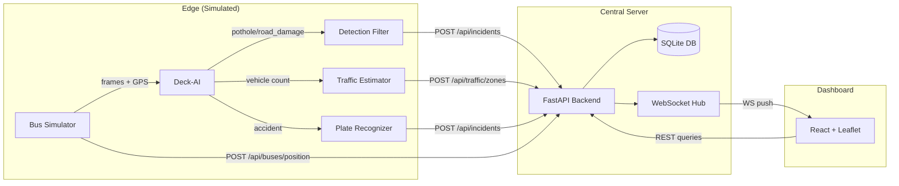

# 🚌 AI-Powered Mobile Urban Intelligence Platform

> **SIH 2026 — Problem Statement SIH26124**  
> *Sponsor: Bharat Electronics Limited*

A software-only prototype that simulates an AI-powered system where cameras mounted on city buses detect road/traffic problems in real time — potholes, damaged road infrastructure, accidents/hit-and-run, and traffic congestion. Each detection is geotagged via GPS and pushed to a central dashboard for city authorities and citizens.

---

## Architecture



## Components

| Component | Tech Stack | Description |
|-----------|-----------|-------------|
| **Backend** | FastAPI + SQLite | REST + WebSocket API, role-based access |
| **Frontend** | React + Leaflet + OpenStreetMap | Live map, incident feed, citizen/authority views |
| **Simulator** | Python + OpenCV | Simulates 1-3 buses on real Hyderabad routes |
| **Deck-AI** | Python (+ optional YOLOv8) | Pothole detection, traffic estimation, plate recognition |

---

## Quick Start

### Prerequisites
- **Python 3.10+** (tested on 3.14)
- **Node.js 18+** (tested on 24.19)

### Option 1: One-command launch

```bash
# 1. Clone / navigate to the project
cd SIH260124

# 2. Create virtual environment & install Python deps
python -m venv .venv
.venv\Scripts\activate         # Windows
# source .venv/bin/activate    # Linux/Mac

pip install -r requirements.txt

# 3. Install frontend deps
cd frontend && npm install && cd ..

# 4. Start everything
python start_all.py --buses 3 --speed 10
```

This starts:
- **Backend** on http://localhost:8000 (API docs at `/docs`)
- **Frontend** on http://localhost:3000
- **Simulator** with 3 buses at 10× speed

### Option 2: Start components individually

```bash
# Terminal 1 — Backend
.venv\Scripts\python -m uvicorn backend.main:app --port 8000

# Terminal 2 — Frontend
cd frontend && npx vite --port 3000

# Terminal 3 — Seed data + Run simulator
curl -X POST http://localhost:8000/api/seed
.venv\Scripts\python -m simulator.bus_simulator --buses 3 --speed 10
```

---

## API Endpoints

| Method | Endpoint | Description |
|--------|----------|-------------|
| `POST` | `/api/seed` | Seed 20 mock incidents + bus positions + traffic zones |
| `GET` | `/api/incidents?role=citizen` | List incidents (citizen view, no bus_id) |
| `GET` | `/api/incidents?role=authority` | List incidents (authority view, full details) |
| `POST` | `/api/incidents/` | Ingest new incident from Deck-AI |
| `GET` | `/api/buses` | Get current bus positions |
| `POST` | `/api/buses/position` | Update bus GPS position |
| `GET` | `/api/traffic/zones` | Get traffic zone density data |
| `POST` | `/api/traffic/zones` | Update traffic zone density |
| `POST` | `/api/auth/login` | Mock login (citizen/authority) |
| `WS` | `/ws` | WebSocket for live updates |
| `GET` | `/api/health` | Health check |

---

## Features

### Dashboard
- **Live map** with bus route polyline, moving bus markers, and incident markers
- **Incident markers** color-coded by type (🟠 pothole, 🟡 road damage, 🔴 accident, 🔵 congestion) and sized by severity
- **Traffic overlay** — route segments colored green/yellow/red for normal/moderate/high density
- **Incident feed** — scrollable, filterable list synced with the map
- **Detail panel** — click any incident for: location, time, bus ID (authority only), accuracy %, snapshot image
- **Citizen / Authority toggle** — authority sees bus IDs, plate numbers, emergency contacts

### Accident / Hit-and-Run Flow
When an accident is detected:
1. Plate recognition (mocked OCR) identifies the vehicle
2. Lookup in mock vehicle registry returns owner + contact
3. 🚨 **Emergency alert banner** appears on dashboard with plate number and contact
4. Alert auto-dismisses after 15 seconds

### Confidence Threshold
Only detections above the configurable threshold (default: 60%) are forwarded to the backend — preventing minor/uncertain detections from flooding the dashboard.

---

## Configuration

Edit `deck-ai/config.py`:

```python
CONFIDENCE_THRESHOLD = 60.0    # Min confidence % to forward detections
FRAME_SKIP = 5                 # Process every Nth frame
ACCIDENT_PROBABILITY = 0.002   # ~1 accident per 500 processed frames
```

---

## Project Structure

```
SIH260124/
├── start_all.py                 # One-command launcher
├── requirements.txt             # Python dependencies
├── backend/                     # FastAPI central server
│   ├── main.py                  # App entry point
│   ├── database.py              # SQLAlchemy models + SQLite
│   ├── schemas.py               # Pydantic request/response models
│   ├── websocket_manager.py     # WebSocket broadcast hub
│   ├── seed.py                  # Mock data seeder
│   └── routes/
│       ├── auth.py              # Mock login
│       ├── incidents.py         # Incident CRUD + ingest
│       ├── buses.py             # Bus position endpoints
│       └── traffic.py           # Traffic zone endpoints
├── frontend/                    # React dashboard
│   ├── src/
│   │   ├── App.jsx              # Main layout
│   │   ├── components/
│   │   │   ├── MapView.jsx      # Leaflet map
│   │   │   ├── IncidentFeed.jsx # Scrollable incident list
│   │   │   ├── IncidentDetail.jsx # Detail panel
│   │   │   ├── AlertBanner.jsx  # Emergency alert
│   │   │   └── LoginToggle.jsx  # Role switcher
│   │   ├── hooks/useWebSocket.js
│   │   ├── context/AuthContext.jsx
│   │   └── utils/api.js
│   └── package.json
├── simulator/                   # Bus simulation
│   ├── bus_simulator.py         # Main simulator loop
│   ├── routes_data.py           # Hyderabad route waypoints
│   ├── video_player.py          # OpenCV video reader
│   └── sample_videos/
│       ├── generate_sample.py   # Synthetic video generator
│       └── sample_road.mp4      # Generated sample video
├── deck-ai/                     # Edge AI detection
│   ├── detector.py              # Detection orchestrator
│   ├── pothole_model.py         # Swappable detection model
│   ├── traffic_estimator.py     # Vehicle counting
│   ├── plate_recognizer.py      # Mocked OCR + registry lookup
│   └── config.py                # Thresholds and settings
└── data/
    ├── mock_plates.json         # Fake vehicle registry (20 entries)
    ├── urban_intel.db           # SQLite database
    └── snapshots/               # Detection crop images
```

---

## Simulated Routes (Hyderabad)

1. **Secunderabad → HITEC City** (16 waypoints, ~15 km)
2. **Mehdipatnam → JNTU** (14 waypoints, ~12 km)
3. **Secunderabad → Charminar** (12 waypoints, ~10 km)

---

## Swapping in a Real Pothole Model

The detection pipeline is designed for easy model swapping:

```python
# In deck-ai/config.py, change:
MODEL_PATH = "yolov8n.pt"
# to:
MODEL_PATH = "https://huggingface.co/peterhdd/pothole-detection-yolov8/resolve/main/best.pt"
```

Then in `pothole_model.py`, use `YOLOPotholeDetector(MODEL_PATH)` instead of the base `PotholeDetector()`.

---

## License

Built for Smart India Hackathon 2026. Educational/prototype use.
